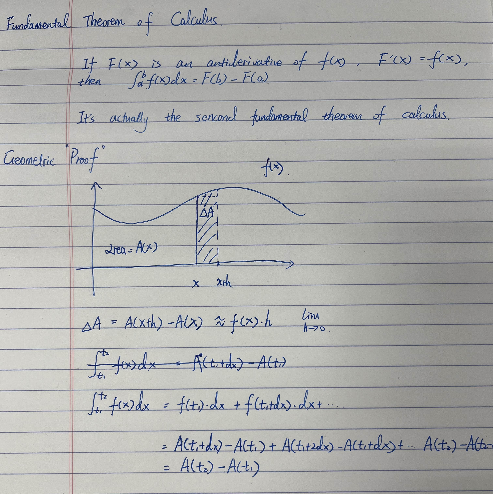

According to [Wikipedia](https://en.wikipedia.org/wiki/Fundamental_theorem_of_calculus), this theorem has two parts. But at most cases, the one that you have to prove during the interview is the second part, saying that the integral of a function $f$ over a fixed interval is equal to the change of any antiderivative $F$ between the ends of the interval. 

This is a question from GS quant engineer superday and I failed to proof it. Everyone learned this at their first year undergrad calculus lecture. However, many years later when your memory gets rusty, it will get you and stress you out at the interview.