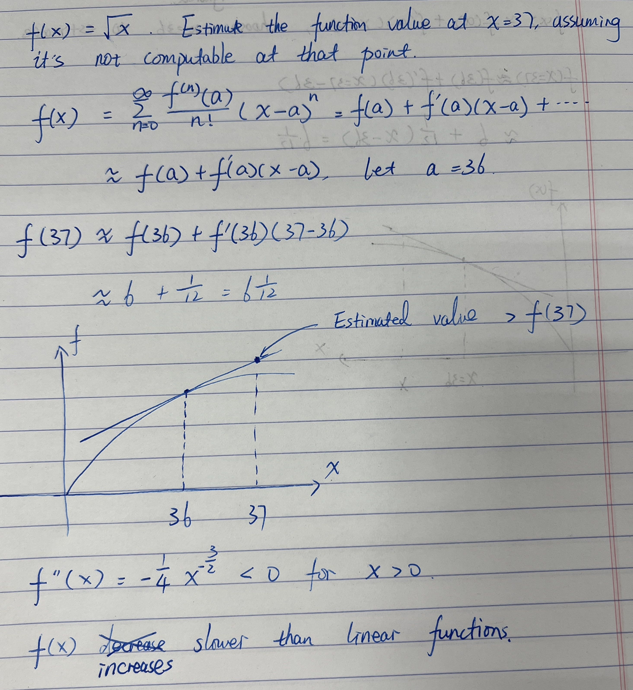

The Taylor Series of a function $f(x)$ around a point a is given by:

$f(x) = \sum_{n=0}^{\infty}\dfrac{f^{(n)}(a)}{n!}(x-a)^n$

The formula itself is not hard to remember. The important thing is that you should be realized when to use it. During the interview, they're not going to tell you should use Talyor Series. 

# Interview with GS

The following is a real interview situation:

I was given a function $f(x) = \sqrt{x}$. Assume the function cannot be computed at $x = 37$, the interview asked to **estimate the function value at that point analytically.** 

The process went like this. I thought out loud, giving a rough range of [6, 7], which is obvious. But then, I was stuck, popping up some stupid ideas like the bisection method. The interviewer reminded me again that I should use analytial way to estimate it. Then, I came up the Taylor Series and use the linear part of it to do the estimation. 

Then, I was aksed a follow up question, "**what value of a you choose to estimate the value**"? 

I said $a = 36$, because it's close enough to $37$ and also easy to compute. Then, a quick follow up question is that **is this estimation larger or smaller than the actual value?**

I was trying to approching this using the convexity(concavity) of the function, because I thought that linear estimation function is gonna cross function $f$ and the estimated point will sit on the segment. But I quickly realized that linear function will be a tengent line touching the function at $x=36$, and $f(x)$ grows slower than linearity, which is concluded by the second derivative of the functions.

