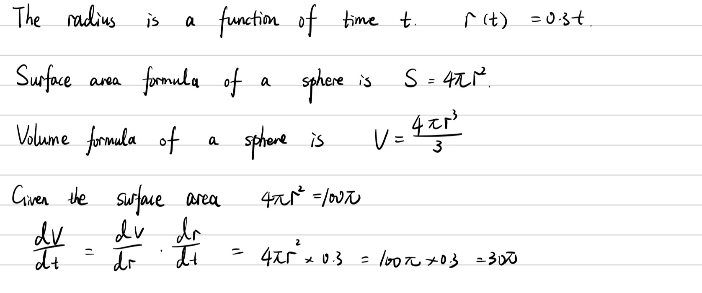
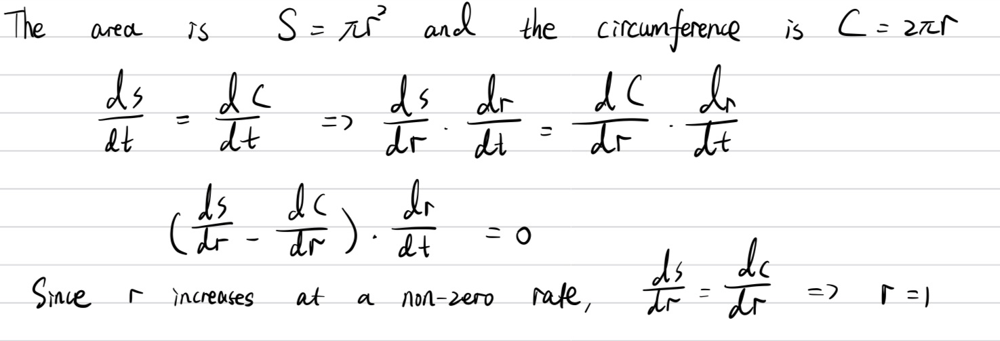
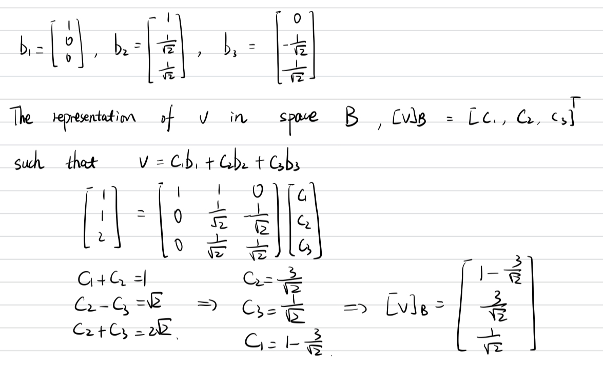

# Question 1: Chain Rule

The radius of a sphere is increasing at the uniform rate of $0.3 \, cm$ per second. At the instant when the surface area $S$ becomes 100 $\pi\, cm^2$, what is the rate of increase, in $cm^3$ per second in the volume $V$? 

**Answer:**

# Question 2: Chain Rule

The radius of a circle is increasing at a nonzero rate, and at a certain instant, the rate of increase in the area of the circle is numerically equal to the rate of increase in its circumference. At this instant, what is the radius of the circle?

# Question 3: Vector Representation

The following basis is given for $R^3$: $ b_1 = [1, 0, 0]$. $ b_2 = [0, 1/\sqrt2, 1/\sqrt2], b_3 = [0, -1/\sqrt2, 1/\sqrt2]$. Denote$ B = {b_1, b_2, b_3}$ and consider the vector $v = [1, 1, 2]$. What is the vector in the representation of space $B$?

# Question 4: Geometric Distribution

You have been given an unlimited pass to take airline flights of your choosing, and you wish to cover all N cities possible. You start at City 1, and every day you take a flight to a random city (you choose one at random from the remaining N - 1 cities. You continue this process the next day from the city you are at currently, until you see all the cities at lease once. How many days does it take you on expectation?

1. When there are N unvisited cities, you have probability 1 to visit a new city.
2. When there are N - 1unvisited cities, you have probability $\dfrac{N-1}{N}$ to visit a new city. The expecte number days to visit a new city according to the geometric distribution is $\dfrac{N}{N - 1}$. 
3. Due to the linearity of expectation, expected days to visit all cities is $(\dfrac{N}{N} + \dfrac{N}{N - 1} + \dfrac{N}{N - 2} + ... + \dfrac{N}{1}) = N(\dfrac{1}{N} + \dfrac{1}{N-1} + ... + \dfrac{1}{1})$, which is N times a harmonic series with logarithmic growth.

Thus, $E \approx Nlog(N)$. 