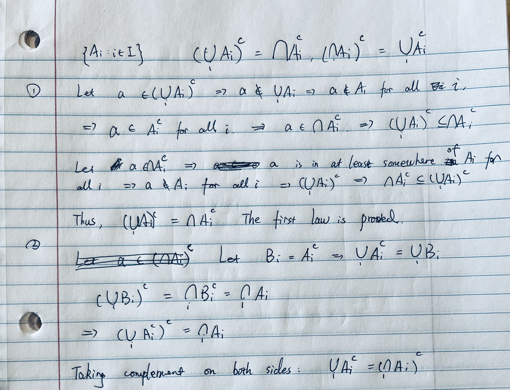

# Question 1

The proof of De Mogan's Law.

- To prove set $A = B$, we separatly prove $A \subseteq B$ and $B \subseteq A$.
- Another fact: if $a \in A$ is a sufficient condition to derive that $a \in B$, then $A \subseteq B$ and vise versa.

