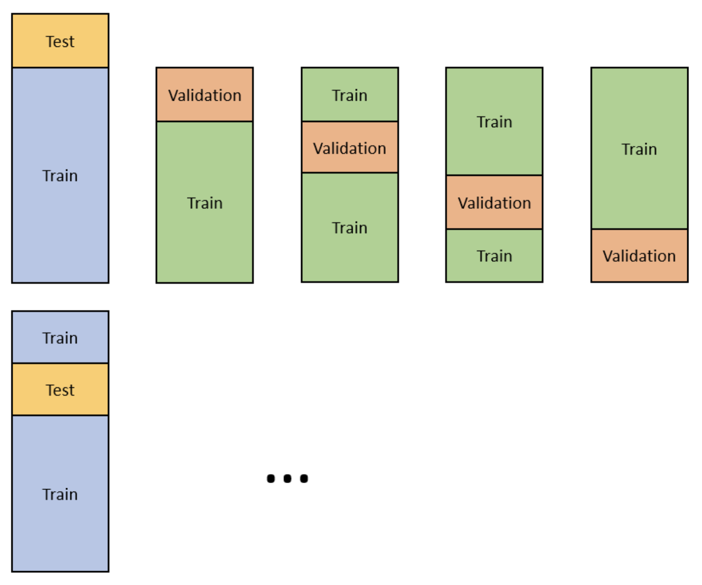

[toc]

# Model Selection

When dealing with the traditional tabular data machine learning, choosing a linear or non-linear model is a very first dealing thing. 

**Check the correlation:** this is a very easy way to have a first glance of the relationship of features and response. If the correlation is really low, it means they have pretty low linear relationship. Then probably choose non-linear model.

## Cross Validation

Split data into train and test. Then further repeadtly conduct cross validation on train set. When have a good result,  test the final result on test set. A common choice of k is 10, after that benefit deminishes quickly.

Besides the mean results of cross validation, another metric os c-v is the variance of data. The variance tells whether the model is sentitive to the variation of data.

After fitting k sub-models, fit the model using the whole training set.

## Nested Cross Validation

## Stratified Cross Validation

Apply for time series data.

# Metrics

## Precision, Recall and F1 Score

Precision: $\dfrac{TP}{TP+FP}$. Recall: $\dfrac{TP}{P}$. F1 = $2\dfrac{Prec\cdot Rec}{Prec+Rec}$. 

## Trade-off in Confusion Matrix

In reality, the cost of false negative and false positive might be different. We could adjust the decision threshold of the model to sacrafice the one type of the fault to optimize the other.

## Receiver Operating Characteristic Curve (ROC)

Adjusting the prediction threshold for the classification, then genearting false positive rate and true positive rate pairs to form the curve.

## Accuracy v.s. Area Under Curve (AUC)

# Feature Engineering

## Feature Scaling

Feature scaling is a method used to normalize the **range of** independent variables or features. It's also known as data normalization.

Should use feature scalling with the following three situations:

1. Use distance-based model. (e.g. KNN)
2. Model using Gradient Descent optimization. (e.g. linear regression)
3. If regularization is applied. Otherwise, coefficients cannot be penalized appropriately.

One thing to note is that scaling is not converting a smaple to normal distribution. If we want to do this, we need to use inverse of inverse transformation.

**Do we scale the target value?**

$w_{t+1} = w_t - \gamma \nabla_w l(f_s(x), y)$, where $l$ is loss function, $f$ is function of parameters and $y$ is the target value. The optimization process depends on the shape (property) of parameter function $f$. Scaling the target value will not affect the speed of convergence. ([Link](https://stats.stackexchange.com/questions/111467/is-it-necessary-to-scale-the-target-value-in-addition-to-scaling-features-for-re))

**What if we use regularized model?**

If we don't scale the response while scaling the independent variables, the parameters might become really large. Will it affect the performance of regularization? But one thing can almost sure is that calculation will generate much more rounding error. (from numerical analysis prospective)

## Class Imbalance

In fraud detection, fraud cases are rare compared to the normal transactions.

- Oversample minority or Drop some majority
- Synthetic minority oversampling technique

## Time Series Cross-Validation

## Time Series Train Test Spliting

# Ensembling Techniques

## Bagging

## Bootstrapping

Add misclassified data to the following weak learners.

## Stacking

## Adaboosting
