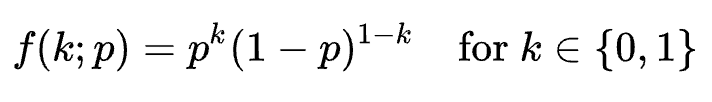

[toc]

# Linear Model

## Linear Regression

## Logistic Regression

### Definition

$\hat{y} = \sigma(z)= \frac{1}{1 + e^{-z}}$ , which is the sigmoid function. $z = b_0 + b_1 x_1 + b_2 x_2 + \cdots + b_n x_n$. The sigmoid function is to make the estimated value's range is 0 to 1 to represent the probability. The learning process is to find out optimal parameter $b_i$.

**Loss (error) function (apply to single observation):** in losgistic regression, its loss function is not $\frac{1}{2}(\hat y-y)^2 $ because this loss function is not convex and cannot be easily optimized. The loss function is derived by maximum likelihood, and the likelihood function is a proudct of Bernoulli pmf. 

$$
\text{Likelihood} = \prod_{i=1}^N (p(y_i))^{y_i} (1 - p(y_i))^{1 - y_i} \\
\text{Log-likelihood} = \sum_{i=1}^N [y_i \log(p(y_i)) + (1 - y_i) \log(1 - p(y_i))] \\
\text{Loss function} = -\sum_{i=1}^N [y_i \log(p(y_i)) + (1 - y_i) \log(1 - p(y_i))]
$$

**class_weight:** A very interesting parameter of the model (sklearn package). It describes the cost for making a false prediction for the label. Sometimes making a false prediction for a positive target is much larger than a false prediction for a negative target.

### Optimization Using Gradient Decent

Let $L$ be the loss function, $p_i$ be the predicted probability and $y_i$ be the actual binary label.

$L = - \sum_{i=1}^N [y_i \log(p(y_i)) + (1 - y_i) \log(1 - p(y_i))]$

Compute the partial derivative of L with respect to $p(y_i)$:

$\frac{\partial L}{\partial p(y_i)} = - [y_i \frac{1}{p(y_i)} - (1 - y_i) \frac{1}{1 - p(y_i)}]$. Note that here we are computing the contribution of each observation $i$.

Now, recall the logistic function:

$p(y_i) = \frac{1}{1 + e^{-z_i}}$

where $z_i = b_0 + b_1 x_{i1} + b_2 x_{i2} + \cdots + b_n x_{in}$

Compute the partial derivative of $p(y_i) $with respect to $z_i$:

$\frac{\partial p(y_i)}{\partial z_i} = p(y_i) (1 - p(y_i))$, (note that this is a famous property of logit function).

Next, compute the partial derivative of $z_i$ with respect to $b_j$:

$\frac{\partial z_i}{\partial b_j} = x_{ij}$

Now, we can compute the partial derivative of the loss function L with respect to $b_j$ using the chain rule:

$\frac{\partial L}{\partial b_j} = \sum_{i=1}^N \frac{\partial L}{\partial p(y_i)} \frac{\partial p(y_i)}{\partial z_i} \frac{\partial z_i}{\partial b_j}$. (To compute the change of parameter $b_j$, we need to sum up contributions of all observations.

Substitute the previously computed partial derivatives:

$\frac{\partial L}{\partial b_j} = \sum_{i=1}^N [- \frac{y_i}{p(y_i)} + \frac{1 - y_i}{1 - p(y_i)}] [p(y_i) (1 - p(y_i))] x_{ij}$

Simplify the expression:

$\frac{\partial L}{\partial b_j} = \sum_{i=1}^N (p(y_i) - y_i) x_{ij}$

Thus, in the **vector form**: 

$\nabla L = \begin{bmatrix} \frac{\partial L}{\partial b_0} \ \frac{\partial L}{\partial b_1} \ \vdots \ \frac{\partial L}{\partial b_n} \end{bmatrix}$, which is the gradient of loss function with respect to each parameter.

$\nabla L = \begin{bmatrix} \sum_{i=1}^N (p_i - y_i) x_{i0} \ \sum_{i=1}^N (p_i - y_i) x_{i1} \ \vdots \ \sum_{i=1}^N (p_i - y_i) x_{in} \end{bmatrix}$

$∇L = \begin{bmatrix} \langle (p - y), \vec{x}_0 \rangle \ \langle (p - y), \vec{x}_1 \rangle \ \vdots \ \langle (p - y), \vec{x}_n \rangle \end{bmatrix}$, which is the inner product form.

$\nabla L = X^T(p - y)$. 

Thus, for a spcific parameter $b_i$, $\delta b_i = x_i \cdot (p_i - y_i)$. (more rigorously times a learning rate)

## Polynomial Regression

Regularization?

# Classification Tree

Genearlly, classification tree divides the feature space into rectangular regions.

## Decision Tree (non-parametric model)

Decision tree prefer categoricald data than continuous numerical data.

### Maximum depth of the tree

Can maximum depth of a decision tree be greater than the number of the features? In most cases, yes. Because, if there are continuous features, then it could be divided into many bins to make decisions. In addition, categorical features may also have more than two category. It also provides more combinations for making decisions.

### Information Gain

**In classification model:** $IG(f, sp) = I(parent) - (\frac{N_L}{N}I(left) + \frac{N_R}{N}I(right))$, where function $I$ is the criteria to measure the **impurity** of a node. There mare many metrics for impurity, for example gini index and entropy.  The learning process will recursively split the data into children nodes until the information gain is 0 (cannot make the sample in children more pure).

**In decision tree regression model:** the impurity of a node is $I(node) = MSE(node) = \frac{1}{N}\sum(y^{(i)} - \bar{y})^2$, $\bar{y}$ is the mean target value of all sample in that node.

## Random Forest

Bagged Decision Trees = Random Forest

Bagging method take average of the prediction, thus, reduce the variance of our model. However, we can't look for the decision boundary of a random forest. But we still could try to count the frequency of feature splitting to have a sense of which are more important.

**Why produce a forest of weak learners that have each seen a portion of the samples and features?**

Prevent overfitting.

# Instance Based Classifiers

## K Nearest Neighbor (KNN)

KNN is an instance based model, it's also called lazy learning model. Because it does not learning a disriminative function from the training data but recording the traning data.

# Unsupervised Model

## Principal Components Analysis

PCA is an orthogonal linear transformation that transforms the data to a new coordinate to maximize the variance of projection on axes. 

The eigenvectors of the covariance matrix represent the principal components (the 
their magnitude. I

### Drawbacks of PCA

- PCA is sensitive to scale of features, because the optimization process mesures the variance of projection.
- Sometimes, it's hard to find the interpretation of principal components especially after scalling.

## Linear Discriminant Analysis

LDA takes advantages of the label. It tries to find a projection (a direction) that maximize the distance groups while minimize the variance within groups. In two dimension situations, the objective function is $max \frac{(\mu_1 - \mu_2)^2}{\sigma_1^2 + \sigma_2^2}$.

Assumption: it assumes that all groups of data are in normal distribution.

## What is the difference between Linear Discriminant Analysis and PCA?

One significant difference is that PCA does not require knowledge of labels, but LDA utilize the Information of label.

**Is there any cases LDA outperforms PCA?**

Yes. There are some cases when projection direction that maximizes the variance cannot linearly separate data. For example, 

If we have no information of data, we certainly cannot assure that data come from different distribution, (if their means are close to each other). Thus, we cannot separate two groups of data. That's not the fault of PCA. However, if we have the oracle, we can certainly find the direction that orthogonal to the covariance direction, to linearly separate two groups of data. However, PCA cannot take the advantage of oracle, still project data to the direction that maximize the variance.

