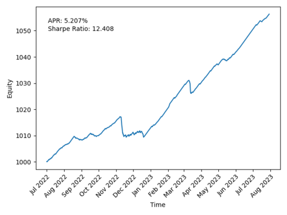
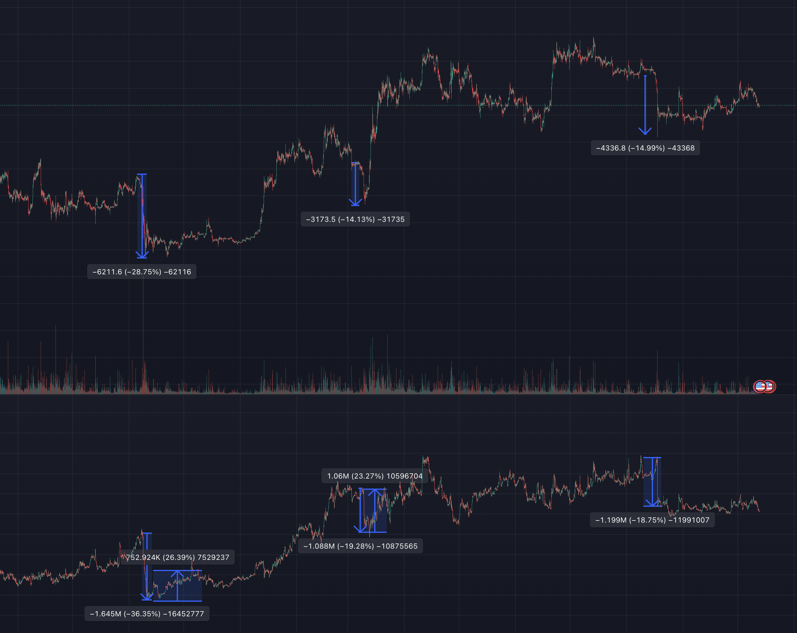
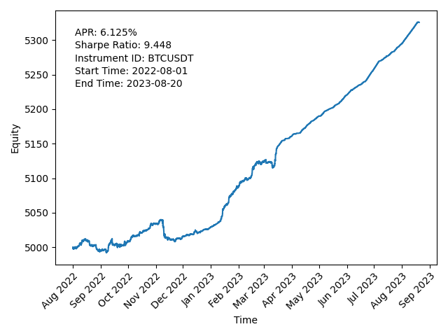
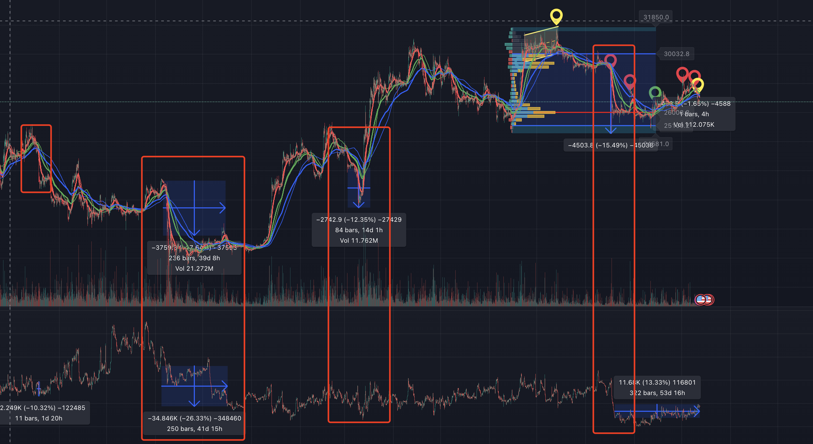

# Funding Rate Arbitrage

The funding rate arbitrage strategy is a low risk strategy that is very stable and can yield 4-6% a year. However, if we are leveraged, we need to avoid several major crashes in a year, otherwise the overall return will be mediocre.

# What is Funding Rate

The Funding Rate is an interest rate used to anchor perpetual futures and spot prices. In a nutshell, if the futures price is higher than the spot price, then those who hold a long position need to pay a fee to those who have a short position. As a result, people will start to close their short positions or go short, so the spread narrows. And vice versa.

# Hard to dynamically arbitrage the funding rate

Funding rate is often correlated with spreads, so when we try to take a position in a certain direction, sometimes we make money on the funding rate but the spreads can make us lose money. At the same time funding rate changes at a period of 8 hours, and if we increase  the frequency of strategy, all the money we make might be lost by slippage in the trades.

Thus, a better idea is to select instrument which has stable funding rate. Then, we avoid the significant drops. A clear indicator that funding rate goes to a bad direction is both of the price and OI drop drastically. 

