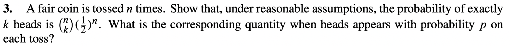
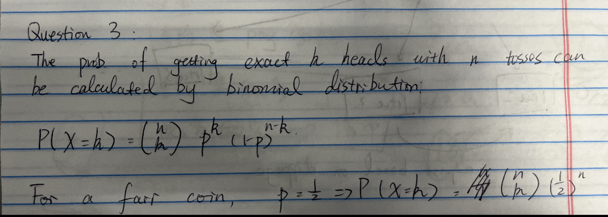

# Question 2

Compute the distribution of a function of a random variable. Given cumulative distribution function of $X$ is $F(x)$, need to compute the cdf of a function $Y = aX+b$. 
$$
G(Y) = P(Y \leq y) = P(aX + b \leq y)\\
\text{if a $\geq$ 0: }P(aX + b\leq y) = P(X\leq \frac{y-b}{a}) = F(\frac{y-b}{a})\\
\text{else: }P(aX + b\leq y) = P(X\geq \frac{y-b}{a}) = 1- F(\frac{y-b}{a})
$$
Then we could further use derivative to compute the pdf of the distribution.

# Question 3

# Question 4

Distribution function: it refers to cumulative distribution function.

Properties of CDF: 

1. Non-decreseasing.
2. It is right-continuous: this means that for any value x, if we approach x from the right, the value of the function approaches F(x).
3. At negative infinity, a CDF is 0: This holds true for both $G$ and $F$. So, $\lambda G(-\infty) + (1 - \lambda)F(-\infty) = 0$.
4. At positive infinity, a CDF is 1: This holds true for both $G$ and $F$. So, $\lambda G(\infty) + (1 - \lambda)F(\infty) = \lambda + (1 - \lambda) = 1$.

Thus $\lambda G + (1-\lambda)F$ is also a distribution funciton. However, $G\cdot F$ is not, because non-decreasing property might not satisfy.
