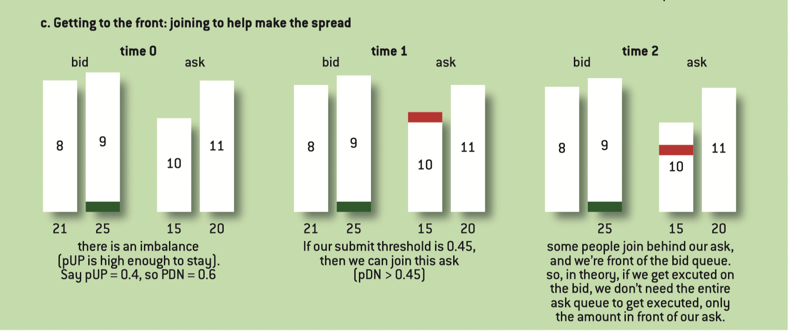

# Decimalization: why it favors HFT firms?

**Volume Increase**

Reducing the tick size makes trading more affordable and appealing for market participants. This can increase the trading volume. Though the spread per trade is lower, higher. number of trades leas to greater revenue.

**Reduce Competition**

Only HFT companies could profit from such small spread using high volume. Traditional market makers are eliminated.

**Rebate**

Exchanges pay rebates to market markers. Though spread decreases but volume increases. More volume means more rebates.

# Strategy Decay

**Market Adaptation**

When a new trading strategy is deployed, especially HFT strategy, other market participants may start to notice the pattern. They either adopt similar strategies or counter yours.

**Data Snooping**

The strategy might overfitted to past data. As time goes forward, the effectiveness of the model decays as it's further way from the training environment.

**Capital Constraints**

As more capital is allocated to the strategy, it inevitablely increases the market impact. Thus, the profitability decreases.

**Sensitivity**

HFT strategy inherently involves high volume and high leverage, which leads to high transaction costs. One can't only profits from the limit order's rebates. It's inevitabe to use market order. Thus, any small change of the market condition will leverage huge impact on profitability.

# Networking

**Network Address Translation**

It's a method that a network device assigns a public address to computers inside a private network. It limits the number of public IP addresses an organization or company must use.

First, company uses private IP. There are reasons like IP resources and security, etc. When it tries to commute with the exchange, it first translates private IP to public IP then sends requests.

However, NAT introduces extra latency. It's an improvable problem.

**WAN Link**

# Order Book Queue Life

**pUP and pDN**

$p_{UP} = \frac{bs_0}{bs_0 + as_0}$ measures the probability of an upward price movement based on the first layer of the order book. $p_{DN} = 1 - p_{UP}$. 

**Trading Rate**

Higher trading rate typically means a more liquid market. It's correlated with the imbalance of the order book , namely the queue sizes at both sides.

**Cancel Rate**

High cancel rates indicates a more strategis play by traders. "The closer your order gets to the front of the queue, the less likely an order in front of it will cancel (so your progression slows)."

**Large Queue Premium**

”If your order is executed on a large queue, then you have a free option to collect the spread.“ This is because there are so many orders waiting behind you for execution at the same price. It's more secure to place a counter-order on the opposite side without worrying immediate price changes. Because takers need to eat up those long queue orders.

**Small Queue Agress**

In another situation, when my limit order is executing and there is only a small queue behind me, I need to quickly use market order to aggress those orders before they have been taken by others and push the price to a more unfavorable direction to prevent loss.

The above topics are important to market makers.

## Queue Jumping

There are two ways to get to the front position.

**Promotion**

You originally place an order in the second layer of order book (or even higher), anticipating that price level will soon become the BBO price. If the prediction is correct, the order moves to the front of the queue because I stayed there when they're not a popular position.

**Joining**

Can't really understand the above example. Should ask David.